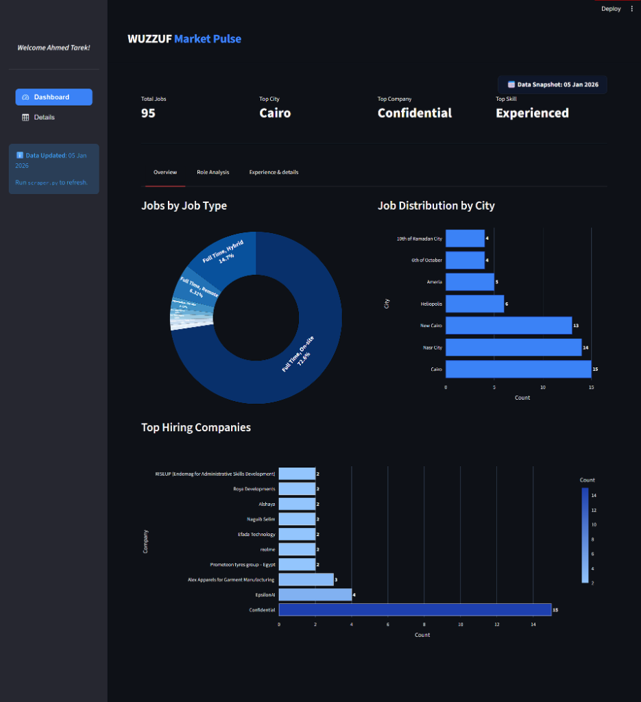
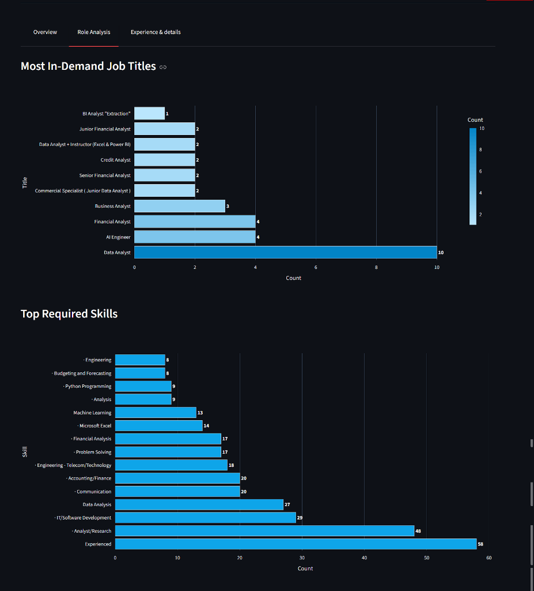
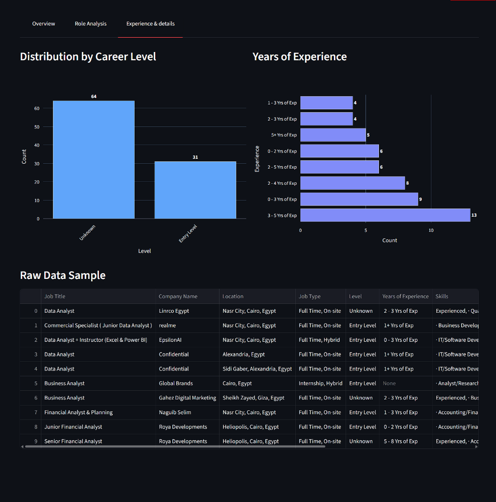
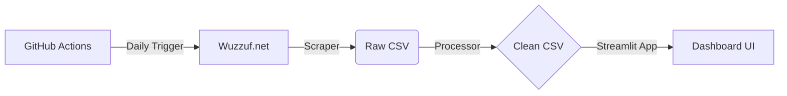

<div align="center">
  

  # Wuzzuf Market Pulse - Job Market Analysis System

  <p>
    
    
    
    <a href="https://wuzzuf-job-market-analysis-v1.streamlit.app/">
      
    </a>
  </p>

  <h3>
    <a href="https://wuzzuf-job-market-analysis-v1.streamlit.app/">🔴 View Live Dashboard</a>
  </h3>
</div>

---

## Project Overview

**Wuzzuf Market Pulse** is a comprehensive, automated data analytics platform designed to monitor and visualize the Egyptian tech job market in real-time. By leveraging a custom-built scraping engine and a Streamlit-based visualization layer, the system provides actionable insights into hiring trends, high-demand skills, and market distribution.

## 📸 Project Showcase

<div align="center">
  
  <p><em>Real-time Market Overview</em></p>
</div>

### 🔍 Deep Dive Analysis
<div align="center">
  
  
</div>


## 🏗️ System Architecture

The solution follows a modular "Extract-Transform-Load" (ETL) architecture.



## 📂 Project Structure

```text
Wuzzuf-Job-Market-Analysis/
├── .github/workflows/   # CI/CD Automation
├── data/                # Data Storage (Raw & Clean)
├── screenshots/         # Project Images
├── app.py               # Main Application (Streamlit)
├── processor.py         # ETL Logic (Cleaning)
├── scraper.py           # Data Extraction
├── requirements.txt     # Dependencies
└── README.md            # You are here
```

### 1. Extraction Layer (`scraper.py`)
-   **Method**: Web Scraping via `requests` and `BeautifulSoup`.
-   **Target**: Wuzzuf.net search results.
-   **Output**: `data/wuzzuf_jobs_raw.csv`.

### 2. Transformation Layer (`processor.py`)
-   **Method**: Cleaning via `pandas`.
-   **Output**: `data/wuzzuf_jobs_clean.csv`.

### 3. Presentation Layer (`app.py`)
-   **Framework**: Streamlit.
-   **Features**: Auto-refreshes data on load.

## Technical Specifications
-   **Language**: Python 3.9+
-   **Key Libraries**:
    -   `streamlit`: Application interface.
    -   `pandas`: High-performance data manipulation.
    -   `plotly`: Interactive data visualization.
    -   `beautifulsoup4`: HTML parsing.

## � Data Dictionary

### 1. Raw Data Schema (`wuzzuf_jobs_raw.csv`)
| Column Name      | Description                                      | Example |
|------------------|--------------------------------------------------|---------|
| `Job Title`      | Title of the job posting.                        | `Data Analyst` |
| `Company Name`   | Name of the hiring entity.                       | `Vodafone` |
| `Location`       | Raw location string.                             | `Maadi, Cairo` |
| `Job Type`       | Employment contract type.                        | `Full Time` |
| `Level`          | Seniority level.                                 | `Senior` |
| `Years of Exp`   | Experience range.                                | `3 - 5 Yrs` |
| `Skills`         | Comma-separated tags.                            | `SQL, Python` |

### 2. Processed Data Schema (`wuzzuf_jobs_clean.csv`)
| Column Name      | Transformation Logic | Description |
|------------------|----------------------|-------------|
| `Location`       | Filtered for "Egypt" | Validated geographic data. |
| `City`           | Extracted from Location | Used for aggregation. |
| `NaN Values`     | Default: "Unknown" | Sanitized for UI stability. |

## 🚀 Deployment & Automation
The system supports two operational modes:

### Local Execution
A Windows batch script (`run_daily.bat`) is provided to orchestrate the dependency check, scraping, and application launch sequences in a single execution context.

### Cloud Automation (CI/CD)
A GitHub Actions workflow (`.github/workflows/daily_scrape.yml`) is configured to:
1.  Execute on a cron schedule (06:00 UTC daily).
2.  Provision an ephemeral runner.
3.  Execute the extraction pipeline.
4.  Commit and push the updated dataset to the repository, triggering a live dashboard update.

## Getting Started

### Prerequisites
-   Python 3.9 or higher.
-   pip package manager.

### Implementation
1.  **Clone the Repository**:
    ```bash
    git clone https://github.com/hazemtarek-mel/Wuzzuf-Job-Market.git
    ```
2.  **Install Dependencies**:
    ```bash
    pip install -r requirements.txt
    ```
3.  **Run the System**:
    -   **Windows**: Execute `run_daily.bat`.
    -   **Manual**:
        ```bash
        python scraper.py
        streamlit run app.py
        ```

---
---
## 👤 Author
**Hazem Tarek**  
*Data Scientist & Machine Learning Engineer*

-   🌐 **GitHub**: [hazemtarek-mel](https://github.com/hazemtarek-mel)
-   📧 **Email**: hazemtarekmel@gmail.com

> *"Turning complex data into clear, strategic intelligence."*

